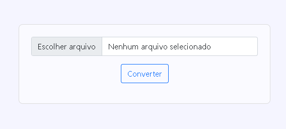

<h1 align="center" >CsvToJson</h1>

<p>
  <a href="#" target="_blank">
    
  </a>
  <a href="https://twitter.com/P0sseid0n" target="_blank">
    
  </a>
  <a href="https://github.com/Posseidon0110" target="_blank">
    
  </a>
</p>

> Convert .CSV files to json



<br>

## Índice
* [Tecnologias usadas](#tecnologias-usadas)
* [Instalação](#instalação)

<br>

## Tecnologias usadas

- EJS
- EXPRESS
- MULTER

<br>

## Instalação

```sh
    npm install
    node index.js
```